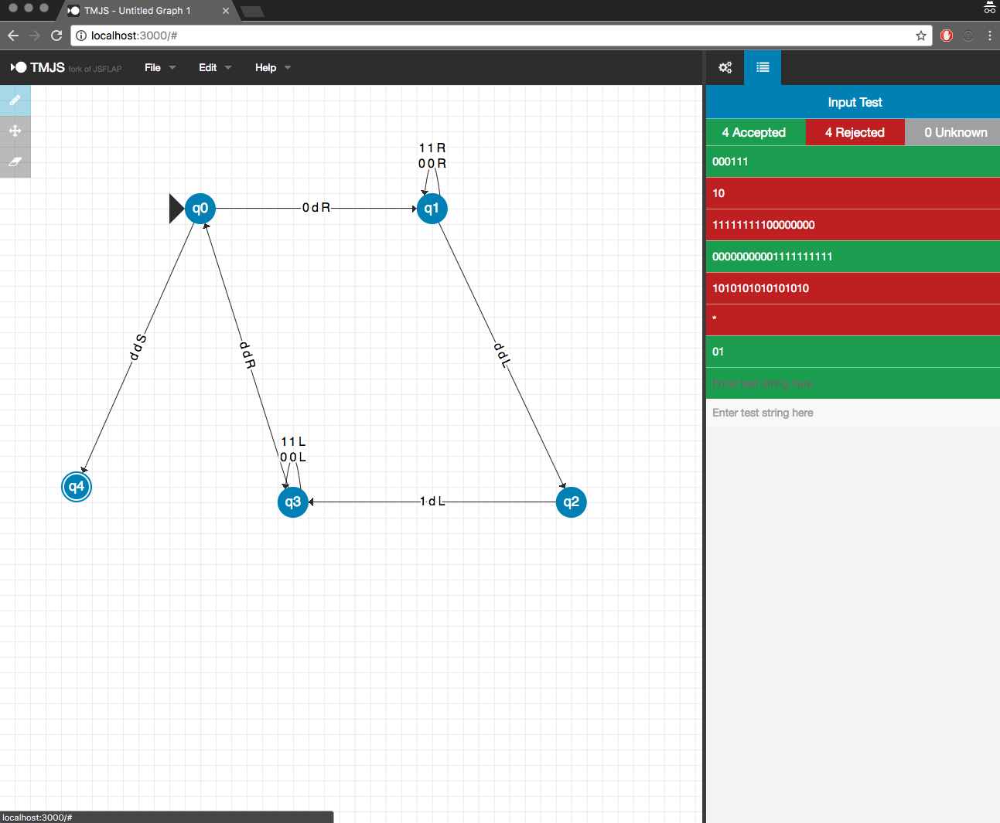

# Graphical Turing Machine Implementation

### By Andrew Lee
---


> It seems probable that once the machine thinking method had started, it would not take long to outstrip our feeble powers… They would be able to converse with each other to sharpen their wits. At some stage therefore, we should have to expect the machines to take control.
> - Alan Turing


---
## Project Hierarchy

| 	Directory   | Description 	                                                               				|
| ------------- | ----------------------------------------------------------------------------------------- |
| assets/  | Content related the the aesthetic presentation of this project such as images  |
| testing/  | Directory for testing various implementations. No relation to final project  |
| source/  | Specifically the C++ Implementation of the Turing Machine and the Web based GUI written in Golang, HTML5, CSS, Angular.js, which comprise the web server. |


---
## Tools

| 	Component   | Implementation Description 	                                           |
| ------------- | -------------------------------------------------------- |
| [Front-End](source/public)  | [HTML](source/public/index.html)/[CSS](source/public/dist/css/jsflap.css)/[Angular.js](source/public/dist/js/jsflap.js) (borrowed heavily from [jsflap](https://github.com/bgrawi/jsflap))|
| [Webserver](source/main.go) | Golang |
| [TM Logic](source/TM.cpp) | C++ |

---
## Description

This is the final project for St. Olaf CS333 Theory of Computation which consists of creating a full GUI implementation for a Turing Machine.

There are 3 parts to this Turing Machine implementation.

Front-end in which the user can define a turing machine, save the machine, and then run test inputs was written in Angular.js (coded primarily by [bgraw](https://github.com/bgrawi), the Golang webserver which converts the TM definition to a systematic format as well as runs the C++ logic portion and returns the state (Accept/Reject) back to the Ajax call, and the turing machine logic portion which is written in C++.

### Turing Machine Logic
To run this, you need to go into [source](source/), and compile [TM.cpp](source/TM.cpp) (you will need to pass std=c++11, std=c++14, or std=c++17, since this C++ program uses newer STL features like tuples).

Example compile configuration (should work in GCC or Clang)
```
g++ -std=c++11 -o TM TM.cpp
```

Essentially, the C++ program is the Turing Machine logic that is able to read the format from a text file, [TM.txt](source/TM.txt).

```
7
0d1
q

R
d 1 1
d 0 6
d 1 4

R
0 1 1
d -1 2
1 1 1

R
d -1 3
_
_

R
0 -1 3
d 1 0
1 1 3

R
0 1 4
d -1 5
1 1 4

R
_
_
d -1 3

A
_
_
_
```

The very first line defines how many states there are. The second line is the unique set of alphabets that represent potential read/write operations. The third line is the rejection char.

Then each subsequent block of text represents a state (there should be 7 block separated by an empty line in the above example [0-6, zero-indexed]). The first line on every block will say R or A (based on if the state is an Accept state or not). Every line after the first in a block represents in order the transition state for the corresponding alphabet definition in line 2. (For the above example, in every block, line 2 corresponds to what happens when you read a 0, line 3 corresponds to what happens when you read a d, line 4 corresponds to what happens when you read a 1). 

In every defining a transition, there will be 3 chars. The first char represents the write value (In the above example, if the first char of line 2 in a block is d [delta], then the transition is to write a d when it sees a 1). The second char is either 1, 0, or -1, and represents the R/S/L operation of moving the head of the input string. The 3rd char is the next state to go to after doing the operation.

### Webserver
Next, you need to run the webserver which is written in Golang. 

```
go build main.go
```

Then to run the entire thing, run “./main”, and access the webinterface by going to localhost:3000 on your browser of choice.

The webserver takes the modified TM definition (as defined by the original FA creator in (jsflap)[https://github.com/bgrawi/jsflap])

(Something like this)

```
NFA:({0dR, ddL, 0dL, 1dR, 1dL, 00R, 11R, 00L, 11L, ddS}, {q0, q1, q2, q3, q4, q5, q6}, {(q0, q1, 0dR), (q1, q2, ddL), (q2, q3, 0dL), (q0, q4, 1dR), (q4, q5, ddL), (q5, q3, 1dL), (q1, q1, 00R), (q1, q1, 11R), (q3, q3, 00L), (q3, q3, 11L), (q4, q4, 00R), (q4, q4, 11R), (q0, q6, ddS)}, q0, {q6})
```
***Note, to view an example of this format, run the webserver, and then File > Export > Automatic Definition on the web UI which will export the definition of the current Turing Machine you are working on.***

The above format has 4 components. First, `{0dR, ddL, 0dL, 1dR, 1dL, 00R, 11R, 00L, 11L, ddS}` defines the transition state changes (0dR = read 0, write d, move head right). Next `{q0, q1, q2, q3, q4, q5, q6}` defines the states. Then, you have the actual TM definition using a format similar to DIMACS formats with edge weights.
```
{(q0, q1, 0dR), (q1, q2, ddL), (q2, q3, 0dL), (q0, q4, 1dR), (q4, q5, ddL), (q5, q3, 1dL), (q1, q1, 00R), (q1, q1, 11R), (q3, q3, 00L), (q3, q3, 11L), (q4, q4, 00R), (q4, q4, 11R), (q0, q6, ddS)}
```
Finally, the last portion `q0, {q6}` defines the start state (q0 in this case) and a accept state (q6 in this case).

When the user defines the TM using the GUI, and hits submit, the code submits the above definition via a HTTP post request. The server then converts that into a text file that can be read by the C++ program in order to define the Turing Machine description file as described in the [Turing Machine Logic Section](#turing-machine-logic).

Furthermore, in The Input Test section of the Front-End asyncronousely calls an Ajax XMLHttpRequest to the server every time the current input field changes (the user deletes a character, or adds new characters). When the webserver handles this request by running the C++ program via running a shell process and providing the input string submitted by the front-end and returns the result (Accept or Reject) back to the Ajax caller. To implement this feature, I had to modify the acceptace/rejection portion of [bgrawi's Angular.js](source/public/dist/js/jsflap.js)(lines 2242-2309) to reflect this.

### [Main GUI Logic](source/public/)
This implementation is a lightly modified version of [jsflap](https://github.com/bgrawi/jsflap) by [bgrawi](https://github.com/bgrawi). The vast majority of this beautiful UI is of his own making, and my tweaks were only some modifications on his original Angular.js code. Namely, the Ajax call to the webserver, modifying the max length property of transition states to be 3 instead of 1 (transition states for finite automatas are length 1, while turing machines need length 3 to define read-write-move_head operations), and disabling the irrelevant parts of the UI in [index.html](source/public/index.html).

---
## Sample Runs (Screen Shots)

> The following examples are taken from Chapter 11 of *Theory of Computation* by Wayne Goddard. 

---
Example 11.1 (page 113): turing machine that accepts the language of binary that contains the specific string 101.

---


Example 11.4 (page 116): turing machine that accepts all even length palindromes.

---

Example 11.2 (page 113): turing machine that accepts the language of binary that is in the form  (n 0's followed by n 1's).

---
Exercise 11.13: turing machine that accepts the language of binary that has the same number of 0's and 1's (but in no particular order)

---
## Contact
Feel free to contact me at [leeas@stolaf.edu](mailto:leeas@stolaf.edu) if you have any suggestions, or want to contribute to this project.

