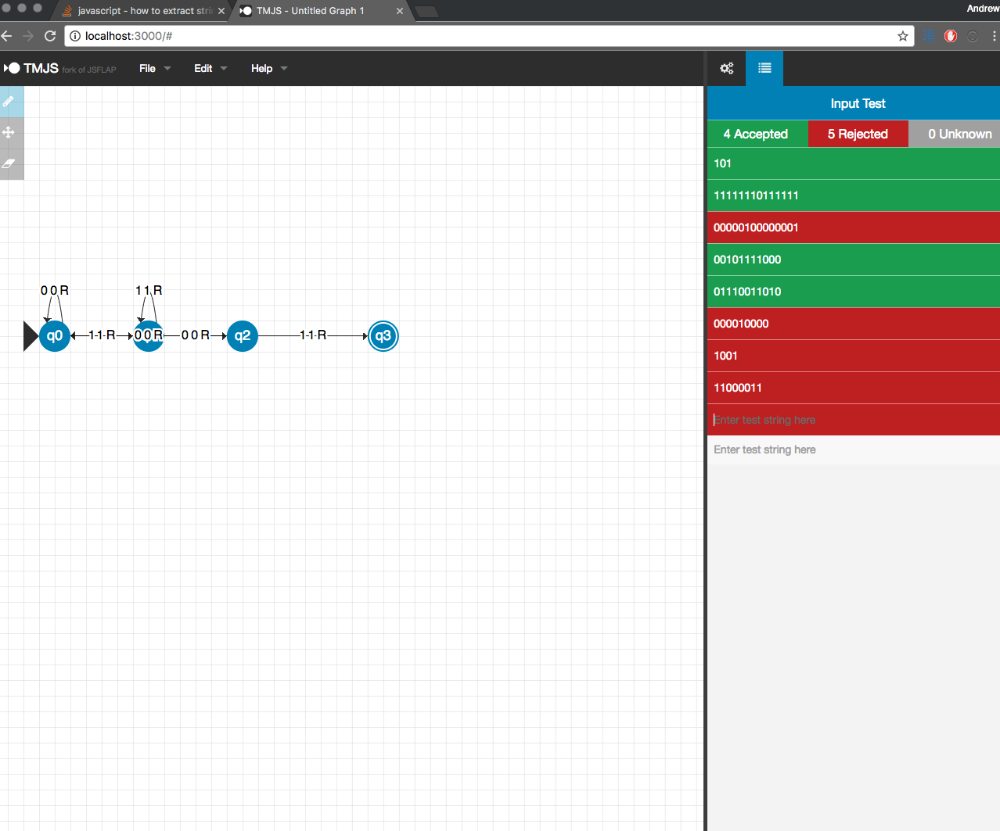
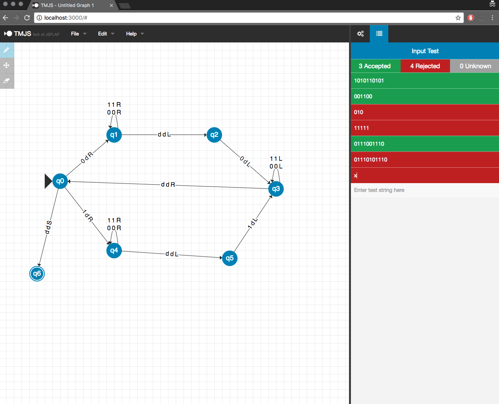
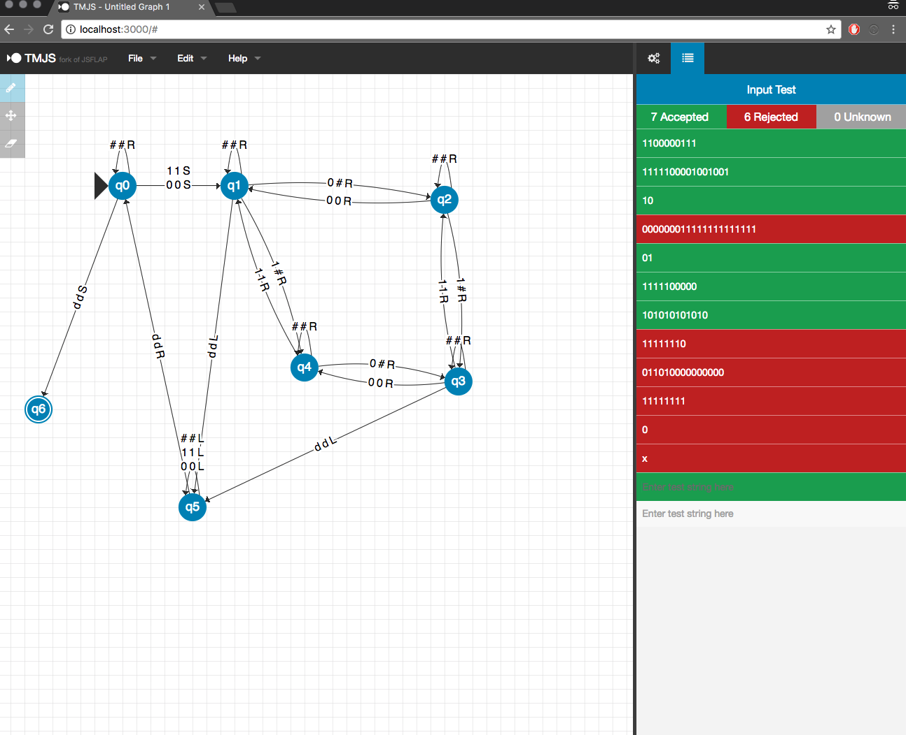

# GUI Turing Machine

### By Andrew Lee


### Project Hierarchy

| 	Directory   | Description 	                                                               				|
| ------------- | ----------------------------------------------------------------------------------------- |
| assets/  | Content related the the aesthetic presentation of this project such as images  |
| testing/  | Directory for testing various implementations. No relation to final project  |
| source/  | Specifically the C++ Implementation of the Turing Machine and the Web based GUI written in Golang, HTML5, CSS, Angular.js, which comprise the web server. |


This is the final project for St. Olaf CS333 Theory of Computation which consists of creating a full GUI implementation for a Turing Machine.

## Implementation

### Tools
Angular.js, C++, Golang

### Description

There are 3 parts to this Turing Machine implementation.

| 	Component   | Implementation Description 	                                           |
| ------------- | -------------------------------------------------------- |
| Front-End  | HTML/CSS/Angular.js (borrowed heavily from [jsflap](https://github.com/bgrawi/jsflap) |
| Webserver | Golang |
| TM Logic | C++ |

### Turing Machine Logic
To run this, you need to go into source, and build TM.cpp (you will need to pass std=c++11, std=c++14, or std=c++17, since this C++ program uses newer STL features like tuples).

Example compile configuration (should work in GCC or Clang)
```
g++ -std=c++11 -o TM TM.cpp
```

Essentially, the C++ program is the Turing Machine logic that is able to read the format in the following format:

```
7
0d1
q

R
d 1 1
d 0 6
d 1 4

R
0 1 1
d -1 2
1 1 1

R
d -1 3
_
_

R
0 -1 3
d 1 0
1 1 3

R
0 1 4
d -1 5
1 1 4

R
_
_
d -1 3

A
_
_
_
```

The very first line defines how many states there are. The second line is the unique set of alphabets that represent potential read/write operations. The third line is the rejection char.

Then each subsequent block of text represents a state (there should be 7 in the above case [0-6, zero-indexed]). The first line on every block will say R or A (based on if the state is an Accept state or not). Every line after the first in a block represents in order the transition state for the corresponding alphabet definition in line 2. (For the above example, in every block, line 2 corresponds to what happens when you read a 0, line 3 corresponds to what happens when you read a d, line 4 corresponds to what happens when you read a 1). 

In every defining a transition, there will be 3 chars. The first char represents the write value (In the above example, if the first char of line 2 in a block is d [delta], then the transition is to write a d when it sees a 1). The second char is either 1, 0, or -1, and represents the R/S/L operation of moving the head of the input string. The 3rd char is the next state to go to after doing the operation.

### Webserver
Next, you need to run the webserver which is written in Golang. 

```
go build main.go
```

Then to run the entire thing, run “./main”, and access the webinterface by going to localhost:3000 on your browser of choice.

The webserver takes the modified TM definition (as defined by the original FA creator in (jsflap)[https://github.com/bgrawi/jsflap))

(Something like this)

```
NFA:({0dR, ddL, 0dL, 1dR, 1dL, 00R, 11R, 00L, 11L, ddS}, {q0, q1, q2, q3, q4, q5, q6}, {(q0, q1, 0dR), (q1, q2, ddL), (q2, q3, 0dL), (q0, q4, 1dR), (q4, q5, ddL), (q5, q3, 1dL), (q1, q1, 00R), (q1, q1, 11R), (q3, q3, 00L), (q3, q3, 11L), (q4, q4, 00R), (q4, q4, 11R), (q0, q6, ddS)}, q0, {q6})
```

And converts it into a text file that can be read by the C++ program in order to define the Turing Machine (description of the file in the [Turing Machine Logic Section](### Turing Machine Logic).

Furthermore, in The Test Input section runs an Ajax call to the webserver which run the C++ program by running a shell process supplying the correct TM definition (TM.txt) and then the test input string. I modified the acceptace/rejection portion of the javascript to reflect this.

### [Main GUI Logic](source/public/)
This implementation is a lightly modified version of [jsflap](https://github.com/bgrawi/jsflap) by @bgrawi. The vast majority of this beautiful UI is of his own making, and my tweaks were only some modifications on his original Angular.js code.

### Sample Runs (Screen Shots)

***The following examples are taken from Chapter 11 of *Theory of Computation* by Wayne Goddard. The specific examples/exercise can be seen if you hover over the screenshot link.

turing machine that accepts the language of binary that contains the specific string 101.


turing machine that accepts all even length palindromes.


turing machine that accepts the language of binary that is in the form  (n 0's followed by n 1's).


turing machine that accepts the language of binary that has the same number of 0's and 1's (but in no particular order)


## Contact
Feel free to contact me at [leeas@stolaf.edu](mailto:leeas@stolaf.edu) if you have any suggestions, or want to contribute to this project.

